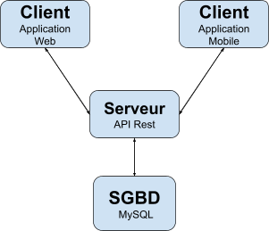

# Architecture matérielle et logicielle

Le projet est constitué de 3 applications : une API, un client mobile et un client web.

## Client mobile

L'application mobile étant l'application principale du projet,
son but est de permettre aux utilisateurs inscrits de pouvoir lancer et suivre leur progression sur des challenges.

Celle-ci a été développée en React Native à l'aide du framework Expo. Ces deux technologies utilisées conjointement
permettent une création et un lancement très rapide du projet, de plus, il existe de nombreuses bibliothèques installables
fonctionnantes sous Expo qui permettent d'accélérer encore plus le développement de l'application.
Une partie du code mobile a été factorisée en TypeScript pour rajouter plus de robustesse et de maintenabilités.

### Bibliothèques principales

- **@react-navigation :** bibliothèque pour la gestion des menus de l'application
- **geodist :** un calculateur de distance par rapport à des coordonnées géographiques.
- **React Native Elements :** bibliothèque permettant de créer facilement des composants graphiques déjà stylisés avec plusieurs
  options incluses. Exemple l'affichage de l'avatar du joueur.
  Lien vers la documentation : https://reactnativeelements.com/docs/

## Client web

L'application web vient accompagner l'application dans son rôle auprès des utilisateurs, mais est l'application principale
utilisable par les administrateurs de challenge.

React JS a été utilisé pour son développement, par préférence personnelle afin notamment de voir ce qu'il est possible
de faire avec React JS pour développer une application complexe. De plus, l'application mobile étant également développée
en React, il est ainsi plus simple de partager du code entre les deux applications, mais aussi, une personne sachant développer
en React JS pourra s'adapter au React Native très facilement.

### Bibliothèques principales

- **React Leaflet :** bibliothèque principale de l'application web, elle est la base de l'éditeur de challenge et permet
  l'affichage des données sur une carte facilement personnalisable pour afficher notre propre "fond" de carte par exemple.  
  Documentation : https://react-leaflet.js.org/
- **Material-UI :** c'est une bibliothèque de composant stylisé (respectant les normes du Material Design préconisé par Google).
  Cette bibliothèque est donc utilisée pour faciliter le design de l'application sans avoir besoin de créer les différents composants.
  De plus, elle intègre un système permettant de créer son propre design si besoin sans avoir à transformer les composants un par un.
  Un dark-mode est nativement intégré. Pour ce projet, Material-UI v5 a été utilisé, c'est la version Alpha qui devrait sortir cette année.
  Comme l'application a été développée d'abord avec Material-UI V4, certaines parties utilisent encore du code de la V4 qui est maintenant déprécié,
  la conversion est toujours en cours.  
   **Documentation :** https://next.material-ui.com/ (v5)
- **Recharts :** bibliothèque permettant de créer des graphiques.  
  Documentation : https://recharts.org/en-US/
- **jest :** utilisé pour effectuer les tests unitaires et tests des composants  
  Documentation : https://jestjs.io/docs/getting-started
- **react-dropzone :** composants permettant de créer une zone de Drag'n'Drop pour déposer des fichiers  
  Documentation : https://github.com/react-dropzone/react-dropzone

## Serveur

Le serveur de prod utilise Ubuntu 20.04 en 64bits. Il possède 2 coeurs et 2 Go de ram.

L'application backend, le serveur de base de données et ke serveur web sont hébergé sur la même machine.

La zone DNS du nom de dommaine **acrobatt.fr** a une entrée configuré en A sur l'ip du serveur.
